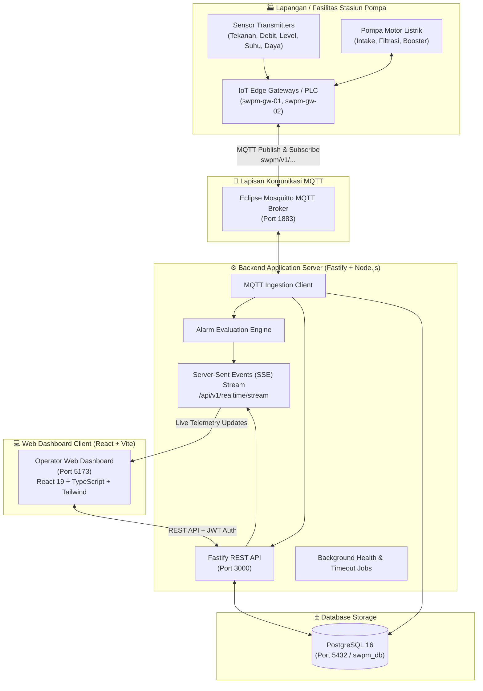

# Smart Water Pump Monitoring System (SWPMS)
### PT Ascon Multi Pratama — Industrial IoT & Telemetry Platform

[](https://fastify.dev/)
[](https://react.dev/)
[](https://www.typescriptlang.org/)
[](https://www.postgresql.org/)
[](https://mosquitto.org/)
[](https://www.docker.com/)
[](https://tailwindcss.com/)

Sistem monitoring, telemetri real-time, dan kendali operasional pompa air industri berbasis web modern. Dirancang khusus untuk memantau performa hidrolik dan elektrik stasiun pompa (Intake, Filtrasi, Distribusi) secara presisi dengan visualisasi responsif, engine deteksi anomali/alarm otomatis, serta sinkronisasi data instan melalui MQTT dan Server-Sent Events (SSE).

---

## 🌟 Fitur Utama Sistem

### 1. 📊 Monitoring Dashboard & Telemetri Real-Time
- **8 KPI Cards Komprehensif**: Lokasi Terpantau, Rata-rata Tekanan (bar), Total Debit Air ($m^3/h$), Pembaruan Terakhir, Konektivitas Edge Gateways, Kesehatan Aset (OEE %), Efisiensi Energi Spesifik (SEC $kWh/m^3$), dan Tingkat Gangguan (Fault Rate %).
- **Dual Fleet View**: Pilihan tampilan kartu visual interaktif (*Grid View*) maupun tabel padat (*Dense Table View*) dengan pencarian instan dan filter status (Aktif, Standby, Gangguan).
- **Interactive Multi-Station Selector**: Filter instan berdasarkan stasiun pompa (WTP Bandung, Stasiun Intake, Stasiun Filtrasi, Stasiun Booster Distribusi).

### 2. ⚡ Kendali & Pemantauan Aset Pompa (Pump Management)
- **Kontrol Motor Real-Time**: Sakelar daya pompa (Start/Stop) dengan status transisi aman (*STARTING*, *RUNNING*, *STOPPING*, *STOPPED*, *FAULT*).
- **Safety Interlock & Emergency Stop**: Fitur penghentian darurat satu klik (*Emergency Stop*) dengan konfirmasi safety untuk mematikan seluruh pompa stasiun seketika.
- **Metrik Elektrik & Hidrolik Lengkap**: Tekanan manifold (bar), flow rate ($m^3/h$), level penampungan tangki (%), daya listrik (kW), arus motor (A), tegangan 3-fasa (V), frekuensi inverter VFD (Hz), suhu motor (°C), dan total konsumsi energi kumulatif (kWh).
- **Grafik Tren & Riwayat Dinamis**: Visualisasi kurva fluktuasi debit dan tekanan multi-parameter menggunakan Recharts.

### 3. 🏢 Stasiun & Area Pengolahan Air (Plant Areas & Stations)
- Struktur hirarkis fleksibel: **Organisasi ➔ Proyek ➔ Site (WTP) ➔ Area / Stasiun ➔ Pompa ➔ Sensor**.
- Manajemen stasiun: Registrasi, pembaruan konfigurasi, dan pemantauan kapasitas unit pompa per stasiun.

### 4. 📡 Sensor & Sinyal Binding (Sensors & Signal Binding)
- Manajemen transmitter analog/digital: Pressure transmitter, electromagnetic flowmeter, hydrostatic tank level sensor, power meter meteran listrik, accelerometer getaran, dan sensor termal PT100.
- Binding sinyal dinamis ke kanal telemetri perangkat IoT.

### 5. 🌐 IoT Edge Gateways & Edge Nodes
- Monitoring status konektivitas gateway lapangan secara real-time (*ONLINE* / *OFFLINE*) dengan mekanisme deteksi heartbeat otomatis (*30s timeout*).
- Pengelolaan konfigurasi IP address perangkat, firmware version, dan diagnostik transmisi MQTT.

### 6. 🚨 Pusat Alarm & Otomatisasi Keselamatan (Alarm Center)
- Evaluasi threshold otomatis berdasarkan operator relasional (`>`, `<`, `>=`, `<=`, `==`, `!=`) dengan filter histeresis *anti-flicker*.
- Manajemen status alarm multi-level: **CRITICAL**, **HIGH**, **WARNING**, **INFO**.
- Alur *acknowledgement* oleh operator lapangan lengkap dengan jejak audit (*audit trail*).

### 7. 👥 Manajemen Pengguna & Hak Akses Berjenjang (RBAC)
- 4 Level peran (*roles*): **Super Admin**, **Engineer**, **Operator**, dan **Viewer**.
- Matriks izin (*permissions*) granular: kontrol pompa, modifikasi stasiun, konfigurasi sensor, pengakuan alarm, manajemen user, dan ekspor laporan CSV.

### 8. 🔒 Sistem Autentikasi Tangguh (Robust Session & Refresh Token)
- Access token JWT dengan masa aktif operasional 7 hari (`ACCESS_TOKEN_TTL=7d`) dan Refresh Token 30 hari (`REFRESH_TOKEN_TTL=30d`).
- Mekanisme **Silent Auto-Refresh** pada frontend: Token diperbarui otomatis di latar belakang saat mendekati kedaluwarsa atau menerima respons 401 tanpa mengganggu pemantauan operator atau memutus sesi pengguna.

---

## 🏗️ Arsitektur Sistem



---

## 📁 Struktur Direktori Repositori

```text
water-monitoring-system/
├── backend/                   # Fastify TypeScript REST API, MQTT & SSE Engine
│   ├── src/
│   │   ├── config/            # Validasi Environment (Zod) & Konstanta RBAC
│   │   ├── infrastructure/    # Koneksi PostgreSQL, Migrasi DDL, Seed, MQTT Client
│   │   ├── modules/           # Modul REST (Auth, Sites, Areas, Assets, Alarms, dsb.)
│   │   ├── plugins/           # Fastify JWT, CORS, Helmet, Swagger, Error Handler
│   │   ├── simulator/         # IoT Edge Simulator (Simulasi 6 Pompa Real-Time)
│   │   └── server.ts          # Entry point server bootstrap
│   ├── .env                   # Konfigurasi environment backend
│   └── package.json
│
├── frontend/                  # React 19 + Vite Dashboard SPA
│   ├── src/
│   │   ├── components/        # Komponen UI (Dashboard, Fleet Table, Modals, Charts)
│   │   ├── hooks/             # Custom Hook (usePumpSystem: state, SSE, actions)
│   │   ├── services/          # HTTP Client API & Token Refresh Handler (api.ts)
│   │   ├── App.tsx            # Komponen root aplikasi & routing tab
│   │   └── main.tsx           # Entry point React Vite
│   └── package.json
│
├── infra/                     # Konfigurasi Mosquitto MQTT broker
│   └── mosquitto/
│       └── config/
│
├── docs/                      # Dokumentasi Proyek (PRD, OpenAPI Spec, Postman Collection)
│   ├── PRD.md                 # Product Requirement Document lengkap
│   ├── openapi.json           # Spesifikasi OpenAPI 3.0
│   └── SWPMS_API.postman_collection.json
│
└── docker-compose.yml         # Container PostgreSQL 16 & Mosquitto Broker
```

---

## 📋 Prasyarat Sistem (*Prerequisites*)

Pastikan perangkat Anda telah terpasang:
- **Node.js**: Versi `20.x` atau lebih baru ([Unduh Node.js](https://nodejs.org/))
- **npm**: Versi `10.x` atau lebih baru
- **Docker & Docker Compose**: Versi terbaru ([Unduh Docker Desktop](https://www.docker.com/products/docker-desktop/))
- **Git**: Untuk cloning repositori

---

## 🚀 Panduan Instalasi & Menjalankan Proyek (*Step-by-Step*)

### Langkah 1: Clone Repositori
Buka terminal dan clone repositori ini:
```bash
git clone https://github.com/sistemagis-admin/water-monitoring-system.git
cd water-monitoring-system
```

---

### Langkah 2: Jalankan Container Database & MQTT Broker
Jalankan PostgreSQL 16 dan Mosquitto MQTT Broker menggunakan Docker Compose dari direktori root:
```bash
docker compose up -d
```
> Pastikan port `5432` (PostgreSQL) dan `1883` (Mosquitto) belum digunakan oleh aplikasi lain di sistem Anda.

Verifikasi status kontainer:
```bash
docker compose ps
```

---

### Langkah 3: Setup & Jalankan Backend Service
Buka terminal baru, masuk ke direktori `backend/`, pasang dependensi, lalu jalankan migrasi dan seed database:

```bash
cd backend

# 1. Pasang dependensi backend
npm install

# 2. Jalankan migrasi skema tabel database
npm run migrate

# 3. Masukkan data awal (seed: stasiun, pompa, sensor, user)
npm run seed

# 4. Jalankan backend development server
npm run dev
```

Server backend akan berjalan di **`http://localhost:3000`**.
- **Interactive Swagger Documentation**: [http://localhost:3000/docs](http://localhost:3000/docs)
- **OpenAPI 3.0 Spec JSON**: [http://localhost:3000/docs/json](http://localhost:3000/docs/json)

---

### Langkah 4: Jalankan Simulator Telemetri IoT Pompa Lapangan
Untuk menyimulasikan data aliran air, tekanan pipa hidrolik, suhu motor, dan konsumsi daya listrik dari 6 pompa lapangan secara dinamis, buka terminal baru dan jalankan simulator:

```bash
cd backend
npm run simulate
```

Simulator akan:
- Mengirimkan data telemetri berkala setiap 5 detik untuk pompa `P-101`, `P-102`, `P-201`, `P-202`, `P-301`, dan `P-302`.
- Mengirimkan sinyal detak jantung (*heartbeat*) gateway setiap 10 detik.
- Merespons perintah remote ON/OFF dari dashboard dan mengirimkan konfirmasi eksekusi (*command ACK*).

---

### Langkah 5: Setup & Jalankan Frontend Dashboard
Buka terminal baru, masuk ke direktori `frontend/`, pasang dependensi, lalu jalankan Vite development server:

```bash
cd frontend

# 1. Pasang dependensi frontend
npm install

# 2. Jalankan development server
npm run dev
```

Dashboard web akan aktif dan dapat diakses melalui browser di:
👉 **[http://localhost:5173](http://localhost:5173)**

---

## 🔑 Akun & Kredensial Login Default

Gunakan salah satu kredensial berikut yang telah disediakan pada database seed:

| Peran (Role) | Alamat Email | Kata Sandi | Deskripsi Hak Akses |
| :--- | :--- | :--- | :--- |
| **Super Admin** | `admin@ascon.co.id` | `Admin@123` | **Akses Penuh**: Seluruh modul, kontrol pompa, registrasi perangkat, user management, audit trail. |
| **Engineer** | `engineer@ascon.co.id` | `Engineer@123` | **Operasional & Teknis**: Manajemen stasiun, sensor, gateway, threshold alarm, dan kontrol pompa. |
| **Operator** | `operator@ascon.co.id` | `Operator@123` | **Monitoring Lapangan**: Monitoring real-time, kontrol pompa start/stop, dan acknowledgment alarm. |
| **Viewer** | `viewer@ascon.co.id` | `Viewer@123` | **Read-Only**: Akses pemantauan dashboard, visualisasi telemetri, dan tren tanpa hak kontrol. |

---

## 🌐 Port Layanan & Endpoint Penting

| Layanan / Modul | URL / Alamat Port | Protokol | Keterangan |
| :--- | :--- | :--- | :--- |
| **Frontend Web App** | `http://localhost:5173` | HTTP | Single Page Application (React 19 + Vite) |
| **Backend REST API** | `http://localhost:3000` | HTTP | Fastify REST API Gateway |
| **Swagger UI Playground** | `http://localhost:3000/docs` | HTTP | Dokumentasi API interaktif |
| **OpenAPI Specification** | `http://localhost:3000/docs/json` | HTTP | OpenAPI 3.0 Schema (untuk Postman/Insomnia) |
| **Realtime Telemetry SSE** | `http://localhost:3000/api/v1/realtime/stream` | SSE / HTTP | Live Server-Sent Events stream |
| **PostgreSQL Database** | `localhost:5432` | TCP | Basis data utama (`swpm_db`) |
| **Mosquitto Broker** | `localhost:1883` | MQTT | Ingestion telemetri & command channel |

---

## 📮 Pengujian dengan Postman

Tersedia dua opsi untuk menguji REST API melalui Postman:

1. **Import via Link (Paling Cepat & Otomatis)**:
   - Buka Postman ➔ Klik tombol **Import**.
   - Tempelkan URL: `http://localhost:3000/docs/json`.
   - Postman akan mengimpor seluruh endpoint lengkap dengan schema request dan parameter.

2. **Import File Koleksi**:
   - Buka Postman ➔ Klik **Import** ➔ **Upload Files**.
   - Pilih berkas [`docs/SWPMS_API.postman_collection.json`](docs/SWPMS_API.postman_collection.json).
   - Gunakan request `Auth > Login (Super Admin)` untuk mendapatkan token JWT secara otomatis.

---

## 🧪 Perintah Build & Pengujian

### Backend
```bash
# Validasi tipe data TypeScript (tanpa build)
npx tsc --noEmit

# Menjalankan pengujian endpoint API otomatis
npx tsx src/scripts/test-api.ts

# Menjalankan pengujian alur integrasi simulator & alarm
npx tsx src/scripts/test-simulator-flow.ts

# Build paket produksi
npm run build
npm start
```

### Frontend
```bash
# Validasi tipe data TypeScript & build bundle produksi
npm run build

# Menjalankan preview hasil build lokal
npm run preview
```

---

## 📄 Lisensi
Hak Cipta © 2026 **PT Ascon Multi Pratama**. Seluruh hak cipta dilindungi undang-undang.
